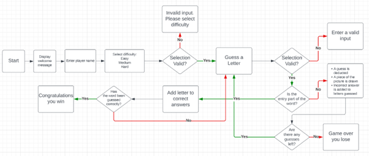

## CONTENT

* [User Experience (UX)](#User-Experience-(UX))
  * [Initial Discussion](#Initial-Discussion)
  * [User Stories](#User-Stories)
  * [How_to_Play](#how-to-play)

* [Design](#Design)
  * [Flowchart](#Flow-Chart)
  * [Features](#Features)
  * [Future Features](#Future-Features)

* [Technologies Used](#Technologies-Used)

* [Deployment](#Deployment)

* [Testing](#Testing)

* [Bugs](#bugs)
  
* [Credits](#Credits)
  * [Code Used](#Code-Used)
  * [Content](#Content)
  * [Acknowledgments](#Acknowledgments)

- - -

## User Experience (UX)

### Initial Discussion

This project is based on the oldschool game of Hangman.

The user must guess the word before hangman is hung. This is done by guessing all letters in the word.

If the guess is right, it is placed in the blank spaces that make up the word. If it is not, the user loses a life. The word must be guessed before the user runs out of lives, otherwise the game is over and they lose.

I have added different difficulties to the game in the form of increasing letter count. i.e. Easy = 6 letters, Medium = 7 Letters, Hard = 8 Letters, all with the same amount of lives.

### User Stories

*	As a user I want to be able to see clearly defined instructions to make my selection.
*	As a user I want to be able to view my remaining guesses.
*	As a user I want to be able to enter my name to play.
*	As a user I want to be able to select a difficulty.
*	As a user I want to be able to see a welcome screen.
*	As a user I want to be able to win this game.
*	As a user I want to have a fair opportunity to lose the game.

### How to Play

* User will need to enter their name.
* They will then need to enter their desired difficulty.
* The user will need to use their keyboard to enter a letter.
* If the letter the user choses is part of the random computer selected word, then all the blank spaces where that letter exists will be populated with that letter.
* After the user has guessed a few letters, they may be able to guess the answer and fill in the remaining letters.
* The user has eight guesses, for every wrong guess, the user will lose one life and a piece of the hangman picture will be drawn.
* If the user cannot guess the word and exceeds their eight guesses, the hangman will be hung and the game will be over.

## Design

### Flow Chart

I designed this project on the basis of the following flow which I designed on Lucid chart. This is a the idea in its most basic form, but it it laid the foundations for the flow I wanted to follow.

### Features

* Welcome page

* Set Difficulty
    * Easy = 6 Letter Words
    * Normal = 7 Letter Words
    * Hard = 8 Letter Words

* Random Word Generator
    * Player cannot see what the word is, only how many letters are in it.
    * A Function randomly generates from a dictionary of words based on the users selected difficulty.

* Limited Guesses and a Graphical Interface
    * The user has a limited number of guesses before the game is over.
    * Remaining Guesses can be seen on screen.
    * A hanging man image also represents guesses lost

* Game over Screens
    * Custom Game Over Screen when the user wins.
    * Custom Game Over Screen when the user loses.

### Future Features

Do to a lot of illness deaths in both my wifes and my own side of the family in the last month I was unable to add as many features as I wanted to due to time constraints.
In the future I would like to improve upon this project by adding:

1. An option for multiplayer.
2. A reset option for users to restart the game whenever they want.
3. A leaderboard with top ten high scores.
4. Prevent correct answers from reducing your guesses.
5. Prevent numbers from being entered as a guess.
6. Add a random word generator rather than a set list
  
## Technologies Used

* Python as the main programming language.
* Lucid chart for creating a flow chart.
* Github/Gitpod as a local repository and for editing code.
* Heroku to deploy the app.

## Deployment

Github Pages was used to deploy the live website. The instructions to achieve this are below:

1. Log into Github.
2. Find the repository for this project.
3. Click on the Settings link.
4. Click on the Pages link in the left hand side navigation bar.
5. In the Source section, choose main from the drop down select branch menu. Select Root from the drop down select folder menu.
6. Click Save. Your live Github Pages site is now deployed at the URL shown.
7. Fork this repository.
8. Create a new Heroku app.
9. Set the buildbacks to Python and NodeJS.
10. Link the Heroku app to repository
11. Select Deploy.

## Testing

* Passed the code through a PEP8 linter and confirmed there are no serious problems.
* Testing was done continuously throughout the project by running the program in the terminal.
* I used the deployed site to manually enter correct and incorrect data to see how the program responded.
* Tested in both Gitpod terminal and CI Heroku terminal.
* Sent the link to Family and Friends to review and point out any bugs or flaws.
* Tested all pre-defined user stories:
    1. As a user I want to be able to see clearly defined instructions to make my selection.
    2. As a user I want to be able to view my remaining guesses.
    3. As a user I want to be able to enter my name to play.
	4. As a user I want to be able to select a difficulty.
	5. As a user I want to be able to see a welcome screen.
	6. As a user I want to be able to win this game.
	7. As a user I want to have a fair opportunity to lose the game.

## Bugs

* When run through the PEP8 Linter there were a number of indentation errors found which were easily resolved.
* In the correct_guess function I iterated through guesses using a for loop blank spaces but the guesses ended up printing vertically. I corrected it using end = " ".
* 

## Credits

### Code Used

* Basic JS was taken from “Code with Ania Kubow” beginner guide and modified, comments in script.js indicate code that was used. - https://www.youtube.com/watch?v=RwFeg0cEZvQ 

### Content

Content for the website was written by Dean Fay.

### Acknowledgments